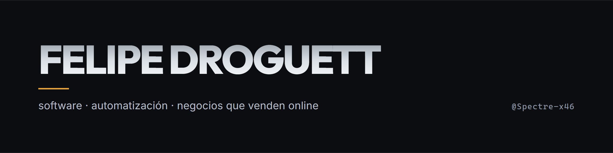
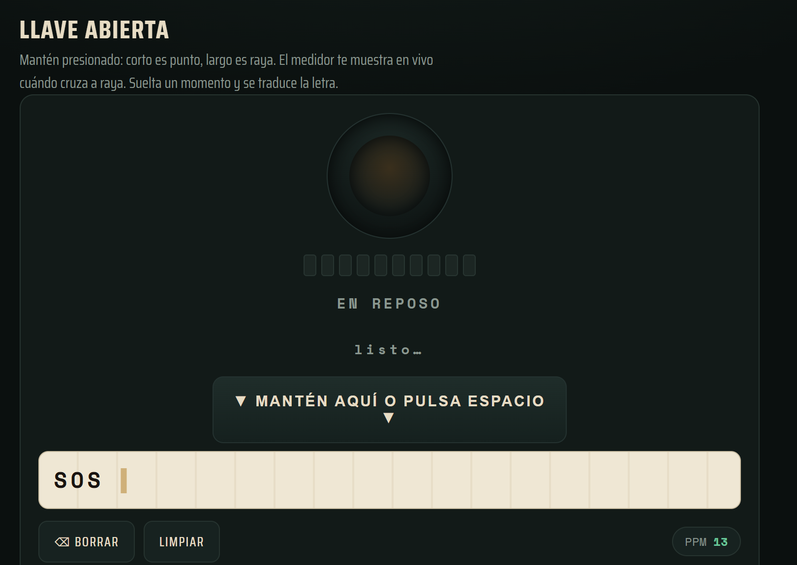
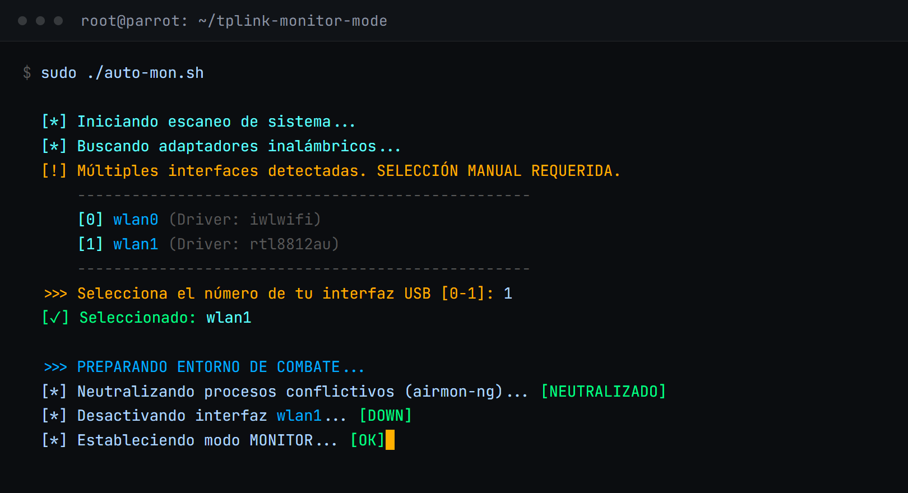

<picture>
  <source media="(prefers-color-scheme: dark)" srcset="./assets/banner-dark.png">
  <source media="(prefers-color-scheme: light)" srcset="./assets/banner-light.png">
  
</picture>

Construyo software y automatizaciones para negocios que venden online: la tienda, las campañas y la atención comercial conectadas al mismo sistema.

Buena parte de lo que escribo hoy vive en repositorios privados de clientes. Lo que hay aquí es lo que puedo abrir entero, con su código y su demo. El trabajo documentado —con métricas fechadas y la deuda técnica declarada— está en el [portfolio](https://felipe-droguett.netlify.app/).

---

## 01 — Ahora

`2026` · **Agente comercial conversacional** — arquitectura, evaluación sobre conversaciones reales y validación. Todavía no atiende clientes.

`2026` · **Portfolio V3** — React, Vite, prerender de rutas en el build y QA de producción.

---

## 02 — Proyectos públicos

<table>
  <tr>
    <td width="44%" valign="top">
      
    </td>
    <td valign="top">
      <h3>El Telégrafo</h3>
      
Estación de práctica de código Morse en el navegador. Se mantiene pulsada la barra espaciadora y el sistema mide cuánto dura cada pulsación para distinguir punto de raya; al soltar, traduce la letra y la escribe en la cinta. Tiene tono, velocidad en palabras por minuto y espaciado Farnsworth ajustables, como un equipo real.

      
Un solo archivo HTML: sin framework, sin dependencias y sin proceso de build.

      
<code>JavaScript</code> · <code>Web Audio API</code> · <code>temporización CW</code>

      
<a href="https://github.com/Spectre-x46/Codigo-Morse">Código</a> · <a href="https://codigo-morse-online.netlify.app/">Probarlo</a>

    </td>
  </tr>
  <tr>
    <td width="44%" valign="top">
      
    </td>
    <td valign="top">
      <h3>tplink-monitor-mode</h3>
      
Pone un adaptador Wi-Fi USB en modo monitor bajo Linux sin ir a ciegas. Detecta las interfaces disponibles y muestra el driver de cada una para poder elegir, cierra los procesos que bloquean el adaptador, cambia el modo y comprueba que la inyección de paquetes funcione de verdad antes de dar la operación por buena.

      
Si la tarjeta ya está en modo monitor lo detecta y ofrece verificarla en vez de reiniciar la conexión.

      
<code>Bash</code> · <code>Linux (Parrot/Kali)</code> · <code>aircrack-ng</code> · <code>iw / ip</code>

      
<a href="https://github.com/Spectre-x46/tplink-monitor-mode">Código</a>

    </td>
  </tr>
</table>

---

## 03 — Con qué trabajo

**Web**
JavaScript · React · PHP · WooCommerce

**Backend y datos**
Python · Django · PostgreSQL · Node.js

**Automatización**
n8n · APIs REST · CRM · LLM

**Sistemas**
Linux · Bash

---

## 04 — Dónde encontrarme

[**Portfolio**](https://felipe-droguett.netlify.app/) — el trabajo, con evidencia y con sus límites declarados
[**LinkedIn**](https://www.linkedin.com/in/fdroguetto/) — trayectoria y contexto profesional
[**Credencial verificable**](https://www.acreditta.com/credential/8f73702b-0511-40f1-80b0-6224284c8eab) — Full Stack Python · Talento Digital para Chile
